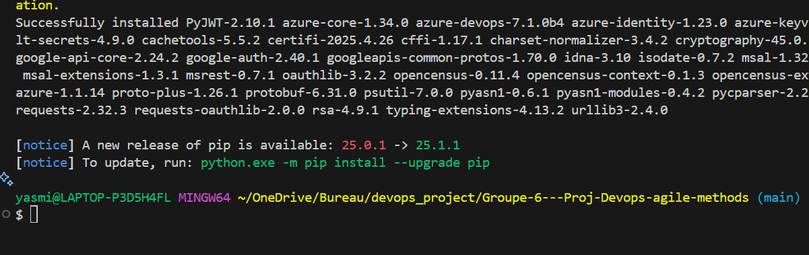

# Team 6 : Devops & Agile methods
 
## Objectif du projet :
 
Notre projet DevOps Notifier, est une application en python qui Surveille un dépôt Azure DevOps, envoie des alertes email à chaque nouveau commit ou échec de build, Permet un petit dashboard de build (texte ou web), et permet de stocker les secrets dans Azure Key Vault.
 
## Fonctionnalités :
 
1. Vérifie régulièrement un dépôt Azure DevOps pour détecter les nouveaux commits ou les échecs de build.
2. Envoie des alertes par email à chaque nouveau commit ou échec de build.
3. Log dans Applications insights.
4. sécuriser des secrets dans Azure Key Vault.
5. Mini dashboard en ligne de commande.
 
## on a installer les dépendances avec la commande suivante :
 
>> pip install azure-devops opencensus-ext-azure azure-identity azure-keyvault-secrets requests
 
Ou directement avec : pip install -r requirements.txt
 

 
 
## Gérer vos repos sur azure devops (git , commit, push , branches, pull, merge …) :
 
>> Voici notre projet sur git :
 

 
On l'a importer sur azure dev pour gérer les pipelines( test , build , deploy ….) :
 

 
 
##  Installation d’autres packages et publier sur azure artifact (feed …)
 
## Logs via Azure Monitor, Application Insights
 
>> On a installé ce qu'il faut avec cette commande en ajoutant dans requirements.txt :
 
opencensus-ext-azure
opencensus-ext-logging
 

 
>> Récupérer la clé Application Insights :
 
Depuis le portail Azure récupérer InstrumentationKey.
 
>> intégrer le projet ( dans logger.py )
>> L'intéger dans le fichier main.py :
 

 
## Activer les alertes en envoyant des email( buil OK ou KO …..) :
 
Notre application intègre un système simple de notification par email pour alerter lors des événements importants comme succès de build ou échec de build.
 
>> La fonction send_email() dans le fichier notifier.py utilise le module Python standard smtplib pour envoyer un e-mail via un serveur SMTP (ici dans notre cas Gmail).
 

 
Pour le mot de passe on A utiliser une variable d’environnement (os.environ['MAIL_PWD']) comme ça on l'importe dans Azure Key Vault
 

